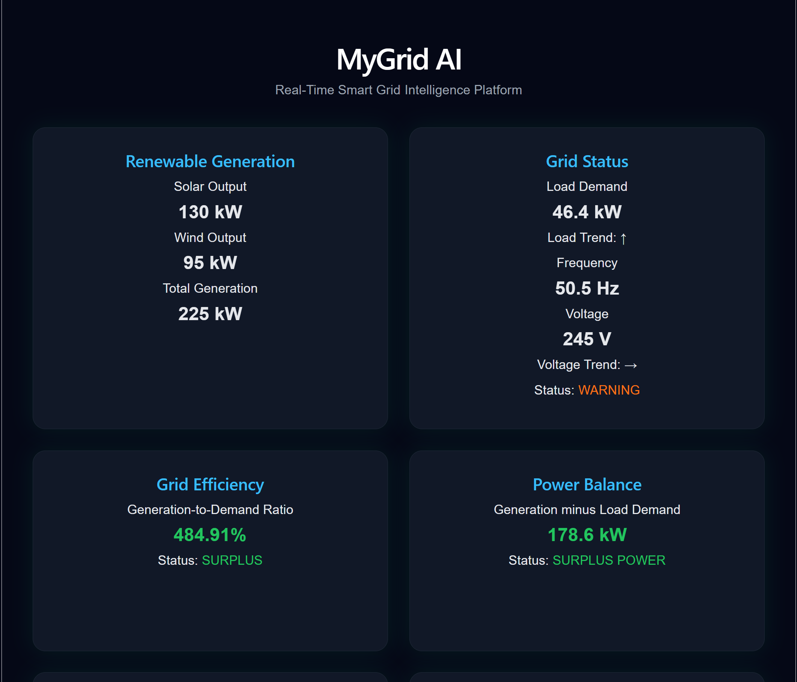
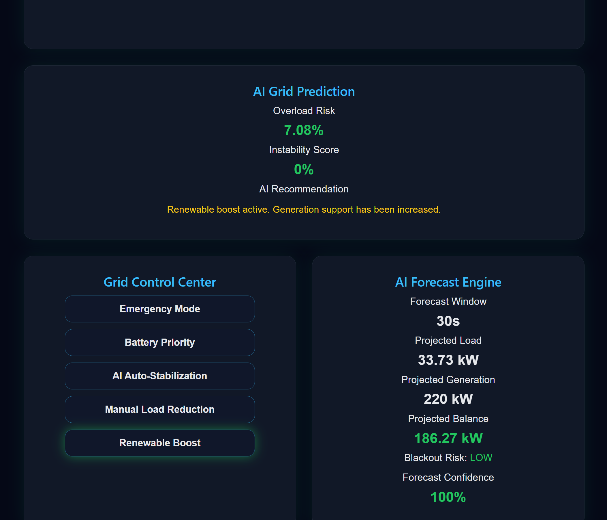
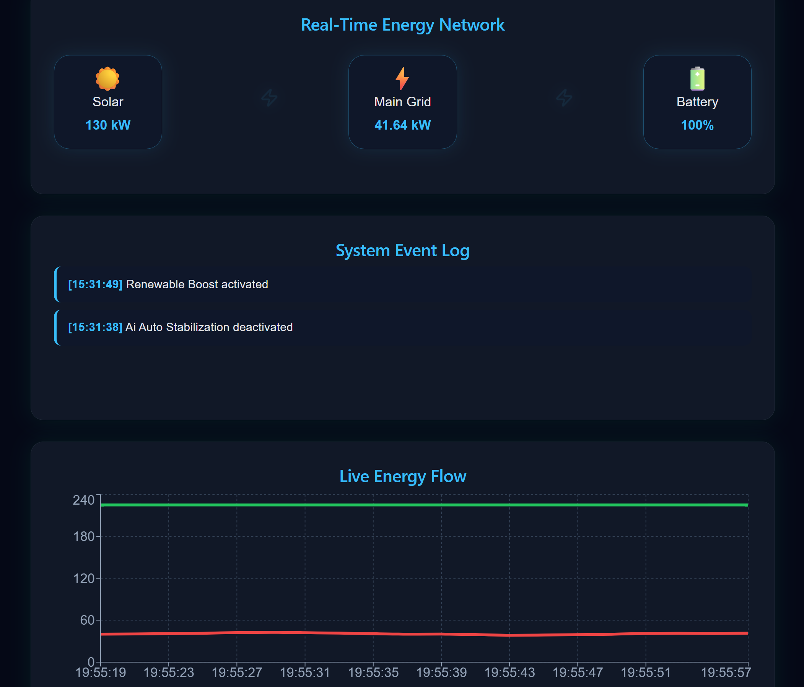

**MyGrid AI**

MyGrid AI is a real-time smart grid intelligence platform that simulates renewable energy generation, electricity demand, battery performance, system health, operational alerts and AI-assisted control decisions.

This project demonstrates how modern software can be used to monitor, predict, and stabilise a simulated energy network using a React frontend, FastAPI backend, WebSocket telemetry and Python.

## Platform Preview

### Dashboard Overview


### AI Control Center


### Live Energy Monitoring



**Key Features**

- Real-time smart grid dashboard
- Live monitoring of renewable energy generation
- Electricity demand, voltage and frequency tracking
- Battery storage simulation
- AI grid prediction panel
- Forecast engine for projected load and generation
- Grid health score calculation
- Blackout risk estimation
- Interactive grid control centre
- Live system event log
- Real-time data streaming (WebSocket-based)
- Historical energy flow chart

**System Architecture**

```text
Frontend Dashboard (React)
        |
        | WebSocket + REST API
        v
FastAPI Backend
        |
        v
Python Grid Engine
        |
        | Simulated telemetry, controls, forecasting logic
        v
AI Prediction Layer
        |
        | Risk scores, health score, recommendations
        v
Telemetry History + System Event Log
```


**Tech Used**
- React   
- JavaScript
- CSS
- Recharts
- FastAPI
- Python
- WebSockets
- Uvicorn

**Core Modules**

Frontend:

The frontend serves as the interactive dashboard interface. It displays live grid telemetry, control buttons, AI predictions, event logs and live charts.

Backend:

The FastAPI backend provide REST endpoints and a WebSocket stream for live communication. It manages control states, telemetry history, system events, and real-time communication with the frontend.

Grid Engine:

The Python grid engine simulates renewable energy generation, load demand, voltage, frequency, battery storage, forecast values, and AI-style risk calculations.

**Dashboard Features**

The dashboard shows:
- Solar output
- Wind output
- Total generation
- Load demand
- Grid voltage
- Grid frequency
- Battery state of charge
- Power balance
- Grid efficiency
- Grid health score
- Forecasted load and generation
- Blackout risk
- AI recommendations
- Live event logs
- Energy flow chart


**Grid Control Centre**

This platform has interactive control modes that affect the simulated grid state in real time and generate system event logs. These control modes are:

- Emergency Mode
- Battery Priority
- AI Auto-Stabilization
- Manual Load Reduction
- Renewable Boost


MyGrid AI can be used as a prototype for understanding how AI-assisted energy platforms could support grid operators. This can be done in ways like:

- Monitoring unstable grid conditions
- Predicting overload risk
- Responding to renewable generation changes
- Managing battery storage behaviour
- Reducing non-critical load during high-risk periods
- Improving visibility through real-time operational dashboards

**How to Run Locally**

Backend:

```text
cd backend
python -m uvicorn main:app --reload
```
Backend runs on:

```text
http://127.0.0.1:8000
```

Frontend:

```text
cd frontend
npm install
npm run dev
```
Frontend runs on:

```text
http://localhost:5173
```

**API Endpoints**

- GET  /grid/status
- GET  /grid/history
- GET  /grid/events
- GET  /grid/controls
- POST /grid/controls/{control_name}
- WS   /ws/grid

**Future Improvements**

- Machine learning anomaly detection
- Real dataset integration
- Cloud deployment
- User authentication
- Advanced battery degradation modelling
- Regional grid map visualisation
- Downloadable reports for grid events
- Historical analytics dashboard

**Importance of this Project**

Modern energy networks are becoming more complex as electricity demand increases, sources of renewable energy fluctuate, distributed battery storage expands and grid stability becomes more difficult to maintain.

MyGrid AI was developed as a real-time smart grid intelligence platform to simulate renewable energy generation, monitor system conditions, predict instability risks and support grid-level decision-making using AI-driven insights.

The platform shows how software systems can enhance visibility, responsiveness and operational awareness within modern energy infrastructures.

By combining real-time telemetry, predictive analytics, control simulation and intelligent monitoring into a single dashboard, MyGrid AI demonstrates how future energy management systems could help create more efficient power networks.

**Author**

Engr. Chimdaalu Iheanacho

**License**

MIT License
