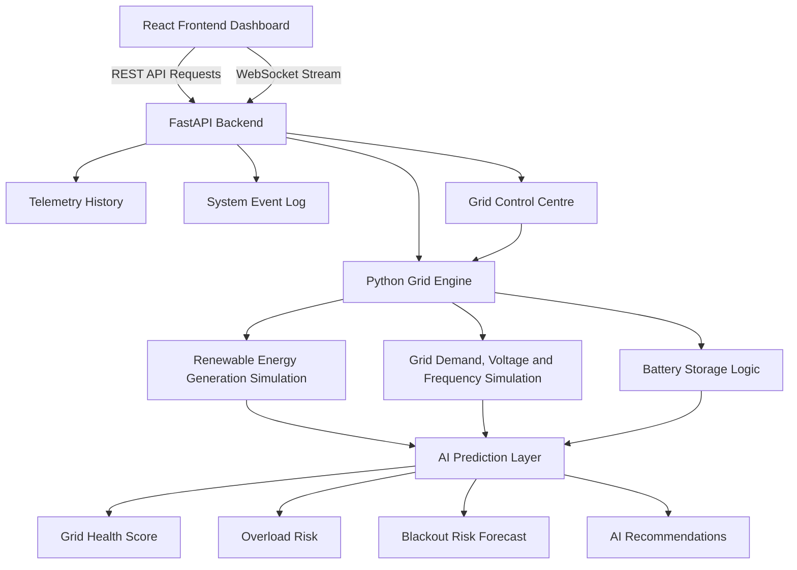

# MyGrid AI System Architecture

```mermaid
flowchart TD
    A[React Frontend Dashboard] -->|REST API Requests| B[FastAPI Backend]
    A -->|WebSocket Stream| B

    B --> C[Python Grid Engine]
    C --> D[Renewable Energy Generation Simulation]
    C --> E[Grid Demand, Voltage and Frequency Simulation]
    C --> F[Battery Storage Logic]

    D --> G[AI Prediction Layer]
    E --> G
    F --> G

    G --> H[Grid Health Score]
    G --> I[Overload Risk]
    G --> J[Blackout Risk Forecast]
    G --> K[AI Recommendations]

    B --> L[Telemetry History]
    B --> M[System Event Log]
    B --> N[Grid Control Centre]

    N --> C
```